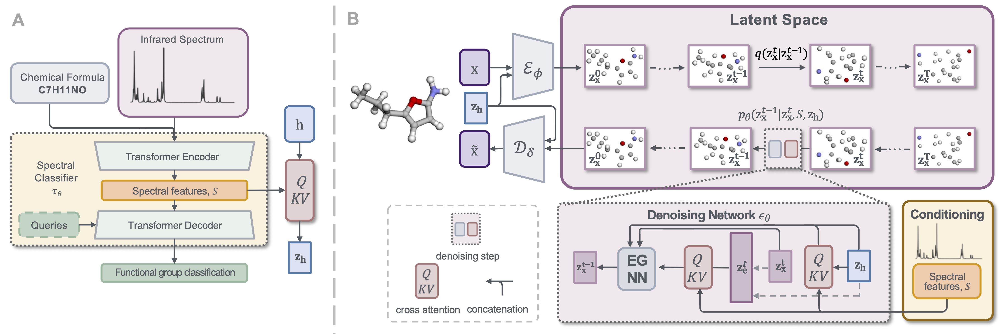

# Latent Diffusion-Based 3D Molecular Recovery from Infrared Spectra

This repository contains the implementation accompanying "[Latent Diffusion-Based 3D Molecular Recovery from Infrared Spectra](https://doi.org/10.1039/d6dd00463f)" (Digital Discovery 2026).


## Abstract

Infrared (IR) spectroscopy, a type of vibrational spectroscopy, is widely used for molecular structure determination and provides critical structural information for chemists. However, existing approaches for recovering molecular structures from IR spectra typically rely on one-dimensional SMILES strings or two-dimensional molecular graphs, which fail to capture the intricate relationship between spectral features and three-dimensional molecular geometry. Recent advances in diffusion models have greatly enhanced the ability to generate molecular structures in 3D space. Yet, no existing model has explored the distribution of 3D molecular geometries corresponding to a single IR spectrum. 
In this work, we introduce **IR-GeoDiff**, a latent diffusion model that recovers 3D molecular geometries from IR spectra by integrating spectral information into both node and edge representations of molecular structures. We evaluate IR-GeoDiff from both spectral and structural perspectives, demonstrating its ability to recover the conditional distribution of molecular geometries corresponding to a given IR spectrum. We further characterise this recovered distribution in terms of configuration-level diversity and conformational consistency. To investigate how spectral information guides the recovery process, an attention-based analysis reveals that the model focuses on characteristic functional-group regions in IR spectra, providing insight into the proposed framework and showing qualitative consistency with common chemical interpretation practices.



## Installation

Downloading preprocessed data from Zendo: 
```
wget -O data.zip "https://zenodo.org/records/22710667/files/data.zip?download=1"

unzip data.zip
```

Clone this repo and move to the root directory:
```
git clone https://github.com/wenjin886/IR-GeoDiff.git

cd IR-GeoDiff
```

create a conda environment and install dependencies:
```
conda env create -f environment.yml

conda activate irgeodiff
```

## Training on QM9S

**Step 1**: training the functional group classifier to obtain spectral features
```
python -m src.train_spec_2_fg_cls \
    --exp_name qm9s_cls_fg20 \
    --num_fg_cls 20 \
    --dataset qm9s \
    --n_epochs 100 \
    --batch_size 256 \
    --lr 0.8 \
    --warmup_steps 1000 \
    --seed 42 \
    --data_dir ../data/qm9s/
```

**Step 2**: training auto-encoder
```
python -m src.train_ae \
    --exp_name qm9s_ae \
    --dataset qm9s \
    --data_dir ../data/qm9s/ \
    --spec_cls_checkpoint ../exp/exp_cls/qm9s_cls/ \
    --use_spec_cls True \
    --cls_weight 1 \
    --use_cross_attn True \
    --use_formula True \
    --h_init_embed True \
    --dim_zh 16 
```

**Step 3**: training diffusion model
```
python -m src.train_diff \
    --exp_name qm9s_diff \
    --dataset qm9s \
    --fix_spec_fg_cls True \
    --data_dir ../data/qm9s/ \
    --num_fg_cls 20 \
    --batch_size 64 \
    --n_epochs 1000 \
    --use_edge True \
    --in_edge_nf 16 \
    --use_formula True \
    --vae_dir_path ../exp/exp_ae/qm9s_ae 
```

## Sampling on QM9S
Downloading checkpoint from Zendo: 
```
cd ../

wget -O exp.zip "https://zenodo.org/records/22802880/files/exp.zip?download=1"

unzip exp.zip
```

Sampling 3D molecular structures from IR spectra using the trained diffusion model:
```
cd IR-GeoDiff

python -m src.sample_diff \
    --save_name check_sample \
    --data_dir ../data/qm9s/ \
    --diff_dir_path ../exp/exp_diff/qm9s_diff \
    --checkpoint qm9s_ir_geodiff_weights.pt \
    --batch_size 300 \
    --sample_times 50 \
    --dataset qm9s
```

## Evaluation on QM9S

**Step 1**: Calculating graph similarity
```
python -m src.code.analysis.structural_analysis \
    --log_name graph_sim.log \
    --test_data ../data/qm9s/fg20_qm9s_final_test_1000.pkl \
    --sample_file path/to/sample_final_xxx.npz \
    --dataset qm9s 
```

**Step 2**: Preparing Gaussian calculation
```
python -m src.code.analysis.generate_gaussian_input \
    --data_file path/to/sample_final_xxx.npz \
    --structral_analysis_result path/to/graph_sim.csv \
    --save_dir ../exp/exp_diff/qm9s_diff/gjf_input \
    --dataset qm9s \
    --NProcShared 16 \
    --num_mol_compute 1000 
```

**Step 3**: Calculating spectral similarity after Gaussian 16 optimization and frequency analysis.
```
python -m src.code.analysis.spec_analysis_match \
    --cal_sis \
    --all_stable \
    --structral_analysis_result path/to/graph_sim.csv \
    --ir_compute_dir ../exp/exp_diff/qm9s_diff/gjf_input \
    --test_data ../data/qm9s/fg20_qm9s_final_test_1000.pkl \
    --dataset qm9s \
    --num_mol 1000

python -m src.code.analysis.spec_analysis_match \
    --log_file_name spec_sim.log \
    --cal_sis_result path/to/ir_computed_sis_1000.pkl \
```

## Citation
If you find this work useful, please consider citing our paper:
```
    @article{wu2026irlatent,
    author = {Wu, Wenjin and Leonardis, Aleš  and Chen, Linjiang and Jiao, Jianbo},
    title = {Latent Diffusion-Based 3D Molecular Recovery from Infrared Spectra},
    journal = {Digital Discovery},
    year = {2026},
    month = {09},
    issn = {2635-098X},
    doi = {10.1039/D6DD00463F}
    }
```